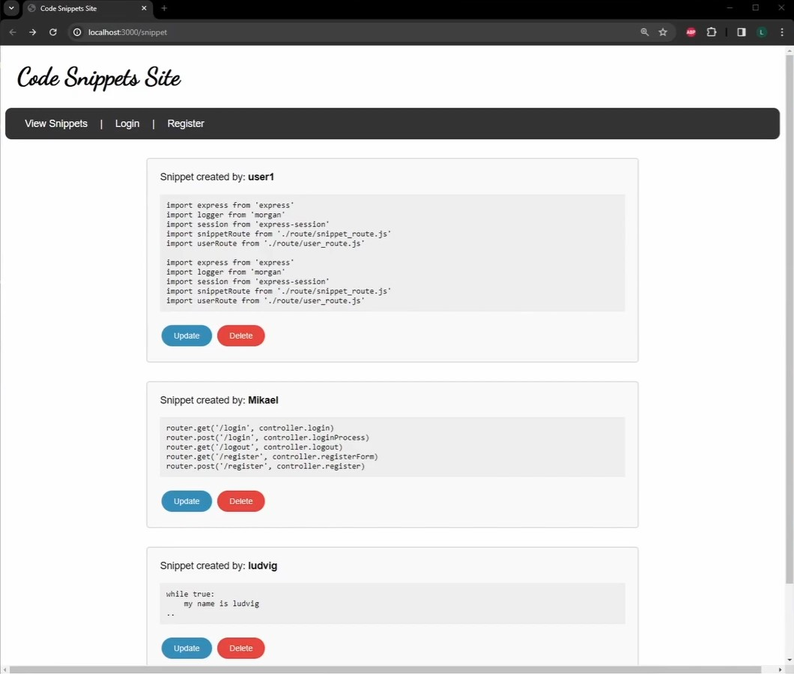

# Code Snippets CRUD App

## Overview
This is a web application that allows users to manage programming code snippets with full CRUD functionality. It is built using Node.js and Express, with MongoDB as the database. It follows the MVC design pattern and includes user authentication and authorization.

## Features
- **CRUD Functionality**: Create, read, update, and delete code snippets.
- **User Authentication**: Register, login, and logout functionalities.
- **Authorization**: Only authenticated users can create, edit, and delete their snippets.
- **Session Management**: Uses express-session for handling sessions.
- **Flash Messages**: Provides clear notifications to users about the application's status.
- **Error Handling**: Returns appropriate status codes (403, 404, 500) for various error conditions.

## Architecture
The application follows the Model-View-Controller (MVC) architectural pattern. The code is structured as follows:

- **`models/`: Contains the Mongoose models for users and code snippets.**
- **`views/`: Contains the EJS templates for rendering the HTML pages.**
- **`controllers/`: Contains the route handlers and business logic.**
- **`routes/`: Contains the route definitions for the application.**
- **`public/`: Contains static assets such as CSS and client-side JavaScript.**

##

##
### Credits
This application was developed as part of a web programming course assignment at Linnaeus University.
